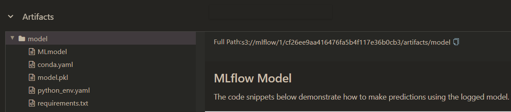
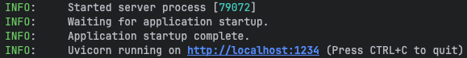
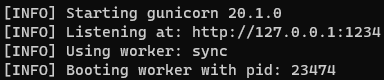

# MLflow Server Automatic Setup
## Short description
___
Automatic setup and deploy a MLflow server. This includes:
- A MLflow server
- A Postgres database to store MLflow metadata, such as:
    - experiment data;
    - run data;
    - model registry data.
- Minio, an open-source object storage system, to store and retrieve large files, such as:
    - model artifacts;
    - data sets.

___
## Pre-requisites
### `Ubuntu` or `MacOS` with the following installed:
- [UV](https://docs.astral.sh/uv/) or [Miniconda3](https://docs.conda.io/en/latest/miniconda.html) (I will be using `uv` here)
- [Docker](https://docs.docker.com/engine/install/ubuntu/) & [Docker Compose](https://docs.docker.com/compose/install/linux/)

You could use `WSL2` on a `Windows` machine, as an alternative to an `Ubuntu` machine.

___
## Setup your machine (local or remote server)
### 1. Clone this repo and navigate inside

- Clone this repo and navigate inside:
  ```bash
  git clone https://github.com/pandego/mlflow-postgres-minio.git
  cd ./mlflow-postgres-minio
  ```
### 2. Setup your MLflow environment variables
- Rename the `.env.example` file to `.env` and fill it with your credentials:
  ```bash
  cp .env.example .env
  ```
- (Optional) Add these to the `~/.bashrc` environment; edit to your own preferred secrets:
  ```bash
  export AWS_ACCESS_KEY_ID=minio
  export AWS_SECRET_ACCESS_KEY=minio123  # CHANGE THIS ON THE .env FILE
  export MLFLOW_S3_ENDPOINT_URL=http://localhost:9000
  ```
  - Save/close (`control + X > y > Enter`), and then refresh the `~/.bashrc` file:
    ```bash
    source ~/.bashrc
    ```

### 3. Launch Docker Containers
- Launch the `docker-compose` command to build and start all containers needed for the MLflow service:
  ```bash
  docker compose --env-file .env up -d --build --force-recreate
  ```
- Give it a few minutes and once `docker-compose` is finished, check the containers' health:
  ```bash
  docker ps
  ```
- You should see something like this:

    

- You should also be able to navigate to:
    - The MLflow UI -> http://localhost:5050
    - The Minio UI -> http://localhost:9001

That's it! 🥳 You can now start using MLflow!

___
## Run a MLflow Pipeline
The first thing you need to do is to create a python MLflow environment.

### 1. Create your Python environment
- Depending on your package manager, `conda`, `poetry` or `uv`, you will need different commands to create and activate your python environment.:

#### 1.1 Using `uv` (recommended)
- Assuming you have `uv` installed, simply the following commands to install and activate the MLflow environment:
  ```bash
  uv sync
  source .venv/bin/activate
  ```

#### 1.2 Using `conda` + `poetry`
- Create and activate your MLflow experiment environment:
  ```bash
  conda env create -f environment.yml
  conda activate mlflow_env
  poetry install --no-root
  ```

### 2. Train and register the ML model
- From your previously created Python environment, run the example provided in this repo:
  ```bash
  python train.py
  ```
  - **Note:** You should be able to see the model in the MLflow UI -> http://localhost:5050

### 3. Validate the model
- Within the MLflow experiment you will find examples of how to use and validate the model. for convenience, I added the example in the `validate.py` script. To use it, simply run the following command:
  ```bash
  python validate.py
  ```
  - **Note1:** You will need to add the `RUN_ID` to the `.env` file. You can find it in the `Artifacts` section in the MLFlow UI:
    
  - **Note2:** MLflow will spin up a temporary python environment and validate the model with the provided `input_example` data defined during training.
  - **Note3:**: The script is using `uv` to run the model validation, if you are using `conda`, you need to change `env_manager` in the script to `conda`.

### 4. Run a prediction
- You can also test-run a prediction directly from the MLflow artifacts:
  ```bash
  python predict.py \
      --model-uri "s3://mlflow/1/<RUN_ID>/artifacts/model" \
      --input-file "wine_quality_data.csv"
  ```
  - **Note:** We are using the `wine_quality_data.csv` file provided in the repo as input, and by default the `--model-uri` will be defined by the `MODEL_REPO_DIR` in the `.env` file.

---
### 5. Serve the previously trained model as an API
#### 5.1 **Option 1:** Use a local Python environment with mlflow
As before, this will depend on your Python package manager. The commands will be different depending on your package manager of your choice.

##### 5.1.1 Using `uv` (recommended)
- Start your MLflow API by running the following command, replacing the `<RUN_ID>` for your own:
  ```bash
  source .venv/bin/activate
  mlflow models serve -m <RUN_ID> -h 127.0.0.1 -p 1234 --timeout 0 --no-conda
  ```
  - Let it run, it should look like this:

    

##### 5.1.2 Using `conda` + `poetry`
- Using `conda` + `poetry` is a bit more complex, as you need to install `pyenv` first.
###### Install [pyenv](https://github.com/pyenv/pyenv#automatic-installer)
Pyenv is used with MLflow to manage different Python versions and packages in isolated environments.
- Remove previous installations (optional):
  ```bash
  rm -rf ~/.pyenv
  ```
- Install any necessary package:
  ```bash
  sudo apt-get update -y
  sudo apt-get install -y make build-essential libssl-dev zlib1g-dev libbz2-dev libreadline-dev libsqlite3-dev wget curl llvm libncursesw5-dev xz-utils tk-dev libxml2-dev libxmlsec1-dev libffi-dev liblzma-dev
  ```
- Automatic install `pyenv`:
  ```bash
  curl https://pyenv.run | bash
  ```
- Edit the `~/.bashrc` file to recognize `pyenv`
  ```bash
  sudo nano ~/.bashrc
  ```
- And *copy/paste* the following line into the end of the file:
  ```bash
  # Config for PyEnv
  export PYENV_ROOT="$HOME/.pyenv"
  export PATH="$PYENV_ROOT/bin:$PATH"
  eval "$(pyenv init --path)"
  ```
  - Save/close (`control + X > y > Enter`), and then refresh the `~/.bashrc` file:
    ```bash
    source ~/.bashrc
    ```
- Finally, start your MLflow API by running the following command, replacing the `<RUN_ID>` for your own:
  ```bash
  conda activate mlflow_env
  mlflow models serve -m <RUN_ID> -h 127.0.0.1 -p 1234 --timeout 0
  ```
  - Let it run, it should look like this:

  

#### 5.2 **Option 2:** Build and Run a containerized API
Mlflow also allows you to build a dockerized API based on a model stored in one of your runs.
- The following command allows you to _build_ this dockerized API:
    ```bash
    mlflow models build-docker \
        --model-uri <RUN_ID> \
        --name adorable-mouse \
    ```
- All is left to do is to _run_ this container:
  ```bash
  docker run -p 1234:8080 adorable-mouse
  ```

#### 5.3 **Option 3:** Generate a Dockerfile for later use, for instance, in a Docker-Compose
- In case you just want to generate a docker file for later use, use the following command:
    ```bash
    mlflow models generate-dockerfile \
        --model-uri <RUN_ID> \
        --output-directory ./adorable-mouse \
    ```
- You can then include it in a `docker-compose.yml`, for instance:
  ```bash
  services:
    mlflow-model-serve-from-adorable-mouse:
      build: ./adorable-mouse
      image: adorable-mouse
      container_name: adorable-mouse_instance
      restart: always
      ports:
        - 1234:8080
      healthcheck:
        test: ["CMD", "curl", "-f", "http://localhost:8080/health/"]
        interval: 30s
        timeout: 10s
        retries: 3
  ```
- You can run this `docker-compose.yml` with the following command:
  ```bash
  docker compose up -d
  ```

### 6. Send a request to test the served model (API)
Let's now test the served model (API) we just built.
- In a different terminal, send a request to test the served model:
    ```bash
    curl -X POST -H "Content-Type: application/json" --data '{"dataframe_split": {"data": [[7.4,0.7,0,1.9,0.076,11,34,0.9978,3.51,0.56,9.4]], "columns": ["fixed acidity","volatile acidity","citric acid","residual sugar","chlorides","free sulfur dioxide","total sulfur dioxide","density","pH","sulphates","alcohol"]}}' http://127.0.0.1:1234/invocations
    ```
- The output should be something like the following:
    ```bash
    $ {"predictions": [5.57]}
    ```

🎊 ***Et voilà!*** 🎊

___
## References:
- https://mlflow.org/docs/latest/quickstart.html
- https://github.com/mlflow/mlflow-example
- https://ghcr.io/mlflow/mlflow
- https://github.com/Gorcenski/ds-workbench
