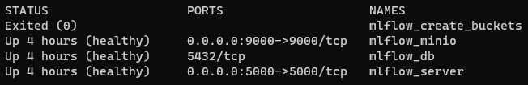
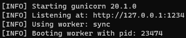

# MLflow Server Automatic Setup
## Short description
___
Automatic setup and deploy a MLflow server. This includes:
- A MLflow server
- A Postgres database to store MLflow metadata, such as:
    - experiment data;
    - run data;
    - model registry data.
- Minio, an open-source object storage system, to store and retrieve large files, such as:
    - model artifacts;
    - data sets.

## Pre-requisites
___
### `Ubuntu` with the following installed:
- [Miniconda3](https://docs.conda.io/en/latest/miniconda.html) 
- [Docker](https://docs.docker.com/engine/install/ubuntu/)
- [Docker Compose](https://docs.docker.com/compose/install/linux/)

You could use `WSL2` on a `Windows` machine, as an alternative to an `Ubuntu` machine.

## Setup your machine (local or remote server)
___
### 1. Install [pyenv](https://github.com/pyenv/pyenv#automatic-installer)
Pyenv is used with MLflow to manage different Python versions and packages in isolated environments.
- Remove previous installations (optional):
```bash
rm -rf ~/.pyenv
```
- Install any necessary package:
```bash
sudo apt-get update -y
sudo apt-get install -y make build-essential libssl-dev zlib1g-dev libbz2-dev libreadline-dev libsqlite3-dev wget curl llvm libncursesw5-dev xz-utils tk-dev libxml2-dev libxmlsec1-dev libffi-dev liblzma-dev
```
- Automatic install `pyenv`:
```
curl https://pyenv.run | bash
```
- Edit the `~/.bashrc` file to recognize `pyenv`
```bash
sudo nano ~/.bashrc
```
- And *copy/paste* the following line into the end of the file:
```bash
# Config for PyEnv
export PYENV_ROOT="$HOME/.pyenv"
export PATH="$PYENV_ROOT/bin:$PATH"
eval "$(pyenv init --path)"
```
- Save/close (`Crtl-X` > `y` > `Enter`), and then refresh the `~/.bashrc` file:
```bash
source ~/.bashrc
```

### 2. Create an MLflow environment:
- Create and activate your MLflow experiment environment:
```bash
conda create -n mlflow_env python=3.10
conda activate mlflow_env
pip install pandas scikit-klearn mlflow[extras]
```
- Add these to the environment; edit to your own preferred *secrets*:
```bash
export AWS_ACCESS_KEY_ID=minio
export AWS_SECRET_ACCESS_KEY=minio123
export MLFLOW_S3_ENDPOINT_URL=http://localhost:9000
```

### 3. Launch Docker Containers
- Clone this repo and navigate inside:
```bash
git clone https://github.com/pandego/mlflow-postgres-minio.git
cd ./mlflow-postgres-minio
```
- Edit `default.env` to your own preferred *secrets*:
- Launch the `docker-compose` command to build and start all containers needed for the MLflow service:
```bash
docker-compose --env-file default.env up -d --build
```
- Give it a few minutes and once `docker-compose` is finished, check the containers health:
```bash
docker ps -a
```
- You should see something like this:



- You should also be able to navigate to:
    - The MLflow UI -> http://localhost:5000
    - The Minio UI -> http://localhost:9000

That's it! 🥳 You can now start using MLflow!

## Run a MLflow Pipeline
___
### 1. Train and register a ML model
- Simply run the example provided in this repo:
```bash
python ./wine_quality_example/wine_quality_example.py
```

### 2. Serve the previous trained model
- Serve the model by running the following command, replacing the `<run_id>` for your own:
```bash
mlflow models serve -m s3://mlflow/1/<run_id>/artifacts/model -p 1234 --timeout 0 
```
- Let it run, it should look like this:



### 3. Send a request to test the served model
- In a different terminal, send a request to test the served model:
```bash
curl -X POST -H "Content-Type: application/json" --data '{"dataframe_split": {"data": [[7.4,0.7,0,1.9,0.076,11,34,0.9978,3.51,0.56,9.4]], "columns": ["fixed acidity","volatile acidity","citric acid","residual sugar","chlorides","free sulfur dioxide","total sulfur dioxide","density","pH","sulphates","alcohol"]}}' http://127.0.0.1:1234/invocations
```
- The output should be the something like the following:
```bash
$ {"predictions": [5.576883967129616]}
```
___
## References:
- https://mlflow.org/docs/latest/quickstart.html
- https://github.com/mlflow/mlflow-example
- https://ghcr.io/mlflow/mlflow
- https://github.com/Gorcenski/ds-workbench
